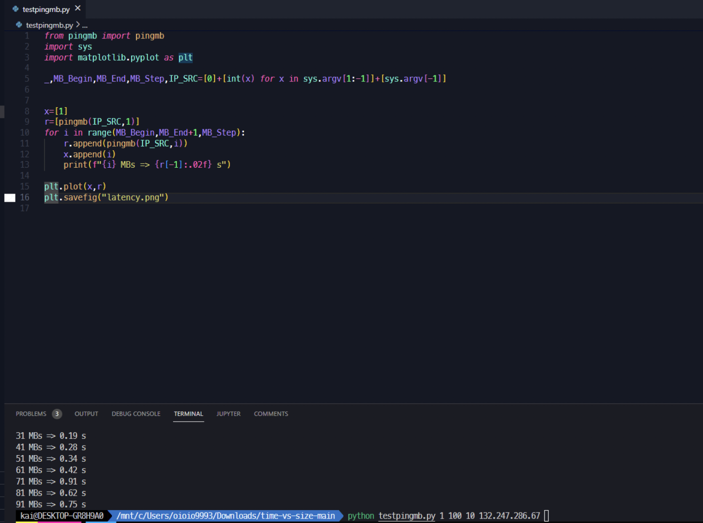
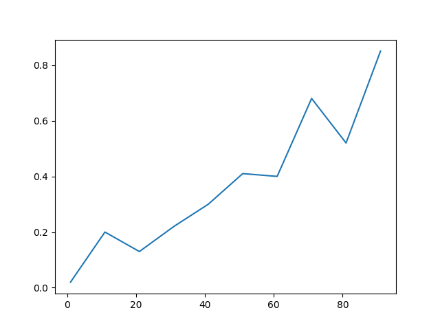

# time-vs-size

By [mirluvams](https://github.com/mirluvams) ([mirluvams@gmail.com](mailto:mirluvams@gmail.com)), student of the Distributed Computing 2022-2 class taught by Dr. [Victor de la Luz](https://github.com/itztli) at [*Escuela Nacional de Estudios Superiores*, campus Morelia](https://www.enesmorelia.unam.mx/), [UNAM](https://www.unam.mx/).

## Problem
This problem consists in implementing the command "[Mb, time_up, time_download] = pingmb -n <Mb> -ip <dst>".
>
where:
> Mb: file size in Mb;
>
> dst: IP destination
  
## Methodology
* Test for 2 interfaces from 192.168.0.200 from 1Mb, 10Mb, 20Mb,... up to 100Mb (in 10Mb steps):
> 10.99.1.138
>
> 132.247.186.67
* Finally, plot size vs. time for up for the two interfaces.
  
## Procedure
### Steps:
> 1) Exchange keys between the web server and the storage server.
> 2) Copy the file to your account's public directory on the web server.
> 3) Use wget and scp for downloading and uploading data.
> 4) Upload everything to github.
> 5) 1Mb = 1024x1024 bytes.
  
  
## Toolset
* [subprocess](https://docs.python.org/3/library/subprocess.html)
* pingmb
* [sys](https://docs.python.org/es/3.10/library/sys.html)
* [matplotlib.pyplot](https://matplotlib.org/)
* [Jupyter](https://jupyter.org/)

## References
De la Luz, V. (2022). Class: Dynamic Systems 2022-2. [ENES Unidad Morelia](https://www.enesmorelia.unam.mx/).

## Conclusions
>
Output: 10 = 12 MB, 21 = 16 MB 31MB = 0.19, 41MB = 0.28, 51MB = 0.34, 61MB = 0.42, 71MB = 0.91, 81MB = 0.62, 91MB = 0.75.
>

>
>
Latency graph where the x-axis represents MB and the y-axis represents time in seconds.
>
>

  
We use Ping to measure latency, which is measured in milliseconds (or ms) the time it takes for the local connection to communicate with a remote computer on the IP network. For this reason, when you are going to carry out a speed test, the first thing that the website is going to carry it out does is measure the Ping, and then it goes on to give you the data download and upload speeds, in this particular case, we are measuring the uploading time.
  
Ping or latency are especially important in those situations in which the immediacy with which we communicate with a server is vital for the activity we are carrying out. A classic example is video games, because if your Ping is high you will have lag and it will take time for what is really happening in an online game to reach your screen. And when the game is about shooting, for example, that can make a difference when it comes to reacting to certain situations.
